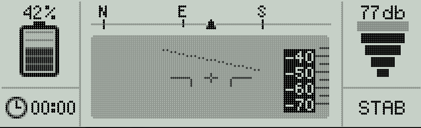
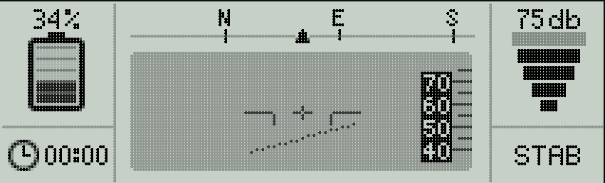
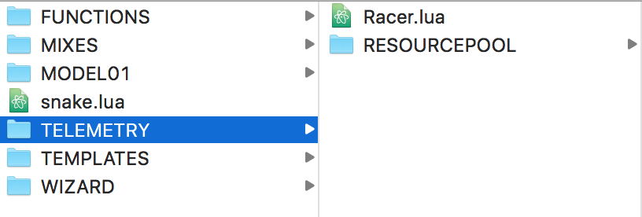

#Open-Tm

Current version: `1.0`

**Open-Tm supports opentx >=2.2. Don't forget to upgrade**

## What it is
Open-Tm is a set of awesome telemetry screens for your favorite OpenTX Radio.
Right now we only support Taranis X9D+

  

## What it does
Open-Tm pulls the telemetry data and displays it in cool widgets.
Really, it's so cool it looks like your OSD.

The following sensors are supported:
 * Hdg : Heading
 * VFAS : Battery level
 * AccX-AccY-AccZ: Accelerometer
 * Flight Mode
 * Flight Timer
 * RSSI
 
## Howto

### 1. Place files on SD Card
Download this repository and unzip its content into the /SCRIPTS/TELEMETRY folder of your Taranis.

The folder should look similar to this:

### 2. Configure Flight Modes
As you may know, your Radio needs to know about your flight modes.
Configure your flight modes in order for the Script to show the current flight mode.

### 3. Configure Flight Timer
In order to show the flight time, the script uses the values given by a Timer.
Configure your timer in order to reflect your flight time on your Radio.

### 4. Configure Script
Open the Racer.lua file with any text editor and change the first lines according to your configuration.
By default, the script assumes that you have a compass on your drone and that the flight timer is timer-0 (the first timer)

### 5. Enable Script as telemetry screen
Go to your Taranis settings and enable your telemetry screen. Congrats!
